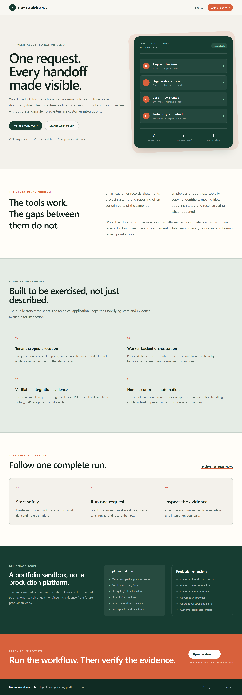

# Norvix WorkFlow Hub

Norvix WorkFlow Hub is a portfolio demo for workflow automation and verifiable system integration in technical service companies.

It turns a fictional service request into a structured case, a generated document, simulated SharePoint evidence, a signed ERP receipt, and a tenant-scoped audit trail. The project demonstrates how manual handoffs can be automated without hiding human review points or presenting demo adapters as customer integrations.

[Portfolio landing page](https://workflow.norvix.no) · [Interactive demo](https://workflow.norvix.no/demo) · [Product brief](docs/product/product-brief.md) · [Three-minute demo script](docs/product/demo-script.md)



## Positioning

**A verifiable integration demo that connects one incoming request to case creation, documents, downstream system updates, and inspectable evidence.**

The reference scenario is a Norwegian technical service company that already uses email, Microsoft 365, a document archive, an accounting or project system, and reporting tools. The product addresses the work between those systems: repeated data entry, manual status updates, attachment handling, and fragmented traceability.

## Demonstrated Workflow

1. A visitor starts an isolated workspace containing fictional data.
2. A service request is structured and validated.
3. Organization data is checked through Brreg, with an explicitly labelled deterministic fallback when the public service is unavailable.
4. The application creates a tenant-scoped case and a generated demo PDF.
5. A functional local SharePoint simulator stores document and operation evidence.
6. A separately hosted ERP demo receiver validates a signed request and returns a persisted receipt.
7. The worker records step duration, attempts, failures, retries, and audit events.
8. The visitor can inspect evidence tied to that exact run.

## What the Project Demonstrates

- End-to-end product engineering with Next.js, ASP.NET Core, PostgreSQL, Docker, and Terraform.
- Tenant-scoped data access and temporary public demo sessions.
- Worker-backed orchestration with explicit step state, retry handling, and idempotent downstream operations.
- Human-controlled intake, AI suggestion review, case, document, delivery, and audit workflows.
- Honest integration boundaries: public service, internal implementation, functional simulator, and separate demo receiver.
- Automated backend, contract, integration, receiver, and browser coverage.

## Integration Boundaries

| System or capability | Demo behavior | Classification |
| --- | --- | --- |
| Brreg / Enhetsregisteret | Performs a public lookup when available and records a labelled fallback otherwise | Live public service with fallback |
| Case, document, PDF, and audit operations | Persisted in the WorkFlow Hub PostgreSQL model | Implemented internally |
| SharePoint | Persists folders, document items, idempotency keys, and operation history locally | Functional simulator; no Microsoft tenant |
| ERP/project system | Sends a signed request to a separate self-hosted receiver and stores its receipt | Functional demo receiver; no customer ERP |
| Email/Outlook | Uses a fictional service request as the scenario source | Seeded demo input; no mailbox connection |
| AI analysis | Stores reviewable suggestions and requires human approval in the broader technical application | Controlled demo workflow; no autonomous decision |

See [Integration Boundaries](docs/product/integration-boundaries.md) for the detailed claim rules.

## Architecture

```text
Browser
  |
  v
Next.js portfolio + demo UI
  |
  v
ASP.NET Core API -----> PostgreSQL
  |                         |
  v                         +--> tenant data + audit evidence
.NET worker
  |----> Brreg public API (labelled fallback available)
  |----> local SharePoint simulator
  +----> signed self-hosted ERP demo receiver
```

The public demo creates a temporary tenant and user for each visitor. The API applies the tenant context, the worker processes the run, and the evidence endpoint returns only resources belonging to that demo session.

More detail is available in [Architecture](docs/architecture.md) and [Data Model](docs/data-model.md).

## Technology

- Frontend: Next.js 16, React 19, TypeScript, Tailwind CSS.
- Backend: ASP.NET Core and .NET 10, C#, Entity Framework Core.
- Data: PostgreSQL and local document storage abstractions.
- Processing: hosted .NET worker with persisted run steps.
- Delivery: Docker Compose, Caddy-compatible home-server deployment, Terraform demo environment.
- Quality: xUnit, ASP.NET integration tests, contract tests, Playwright, ESLint, GitHub Actions.

## Repository Structure

```text
workflow-hub/
  backend/
    src/
      NorvixHub.Api/
      NorvixHub.Application/
      NorvixHub.Domain/
      NorvixHub.Infrastructure/
      NorvixHub.Worker/
      NorvixHub.ErpDemoReceiver/
    tests/
  frontend/
  connectors/
  infra/
  docs/
  scripts/
```

## Local Development

Requirements:

- Docker Desktop or Docker Engine with Compose.
- .NET SDK version defined in `global.json`.
- Node.js and npm.

Copy `.env.example` to `.env`, set `ERP_DEMO_SIGNING_SECRET` to a generated local value, then run:

```powershell
npm run dev
```

Open `http://localhost:3000`. The frontend, API, worker, PostgreSQL database, and ERP demo receiver are defined by the local development workflow.

## Verification

```powershell
npm run test:backend
npm run test:frontend
npm run test:e2e:public-demo
```

Additional migration and Compose checks are documented in [Testing Strategy](docs/testing-strategy.md).

## Deliberate Limitations

- This is a portfolio demo, not a production workflow platform.
- Only fictional data may be used.
- Public workspaces expire and are cleaned automatically.
- The demo does not connect to Outlook, Microsoft 365, a customer ERP, or a customer reporting environment.
- SharePoint behavior is provided by an explicitly labelled local simulator.
- The ERP endpoint is a separate demonstrator owned by this project, not a third-party accounting system.
- Brreg availability and response time are outside the application's control, so fallback use remains visible.
- Production identity, customer-specific authorization, secrets governance, contracts, operational monitoring, backup policy, and legal assessments require deployment-specific work.

See [Demo Boundaries](docs/product/demo-boundaries.md) and [Current Implementation Status](docs/current-implementation-status.md).

## Documentation

### Product

- [Product brief](docs/product/product-brief.md)
- [Demo script](docs/product/demo-script.md)
- [Demo boundaries](docs/product/demo-boundaries.md)
- [Integration boundaries](docs/product/integration-boundaries.md)
- [Product walkthrough](docs/product-walkthrough.md)
- [Current implementation status](docs/current-implementation-status.md)

### Engineering

- [Architecture](docs/architecture.md)
- [API contract](docs/api-contract.md)
- [Data model](docs/data-model.md)
- [Security and privacy](docs/security-and-privacy.md)
- [Testing strategy](docs/testing-strategy.md)
- [Technology decision](docs/decisions/0001-technology-stack.md)

### Operations

- [Home-server deployment](docs/deployment-home-server.md) — permanent public demo, released through the protected `Deploy Home Server` workflow without paid cloud infrastructure.
- [Azure demo deployment](docs/deployment-demo-azure.md) — optional reference target that requires separately provisioned, potentially billable Azure resources.
- [ERP demo receiver](backend/src/NorvixHub.ErpDemoReceiver/README.md)
- [Restore procedure](scripts/restore-home-server.md)

The running home-server revision is available from `GET /health/version`, including the commit SHA, build date, environment, and deployment target.

### Implementation History

- [Verifiable integration demo plan](docs/verifiable-integration-demo.md)
- [SharePoint simulator amendment](docs/sharepoint-simulator-amendment.md)
- [Plan registry](docs/plans.md)

## Portfolio Message

WorkFlow Hub does not claim a finished customer integration or measured savings. It demonstrates a credible implementation pattern: automate one bounded process, keep human control visible, make failures recoverable, and provide evidence for every completed step.
