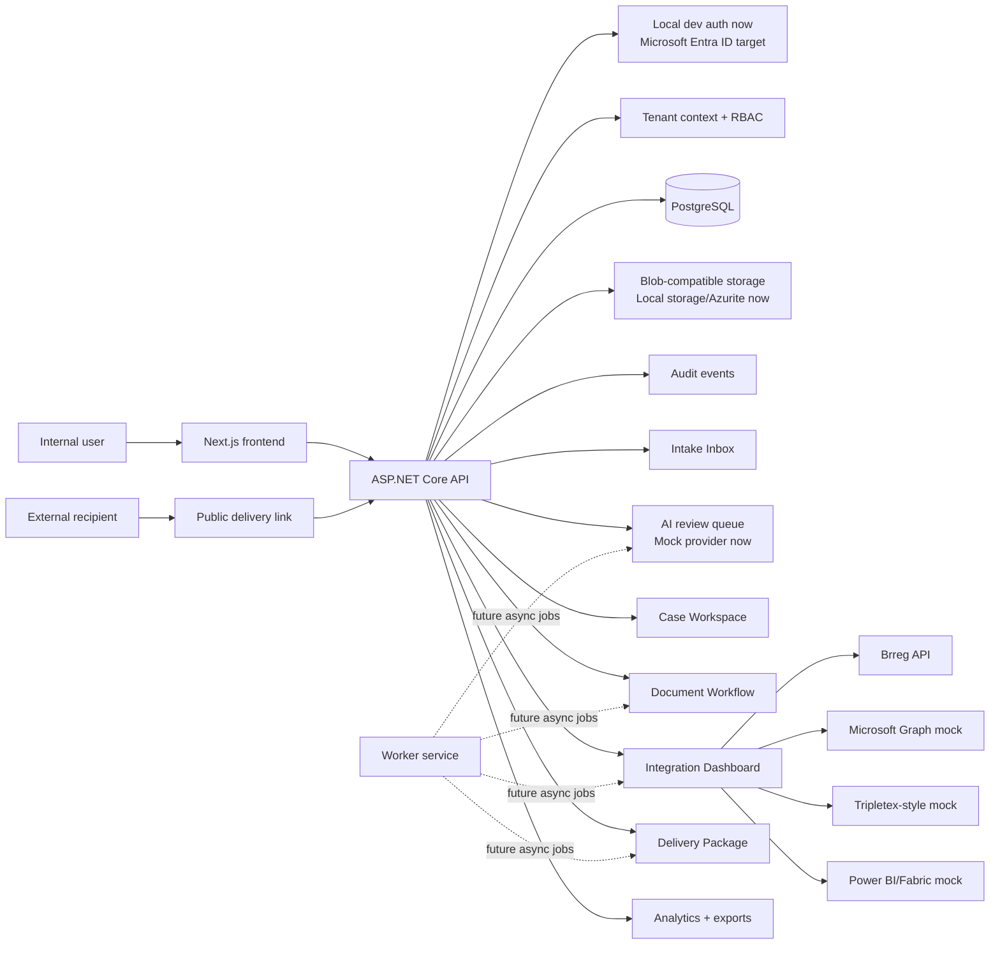
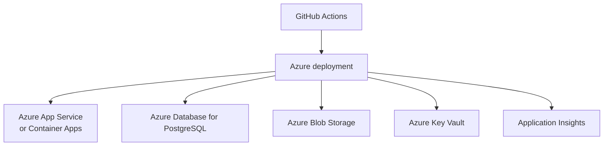

# Architecture Diagram

## Request Flow

1. Requests enter through manual entry, mock email/form, or API.
2. The API resolves tenant context from the authenticated user membership.
3. Every business query is scoped to the current tenant.
4. AI and integration providers operate behind adapter interfaces.
5. User approvals convert AI suggestions into final data.
6. Delivery links use random tokens; only token hashes are stored.
7. Public delivery access is logged and exposes only selected package items.
8. Analytics endpoints aggregate tenant-scoped operational data and export CSV/JSON.

## Deployment Target

