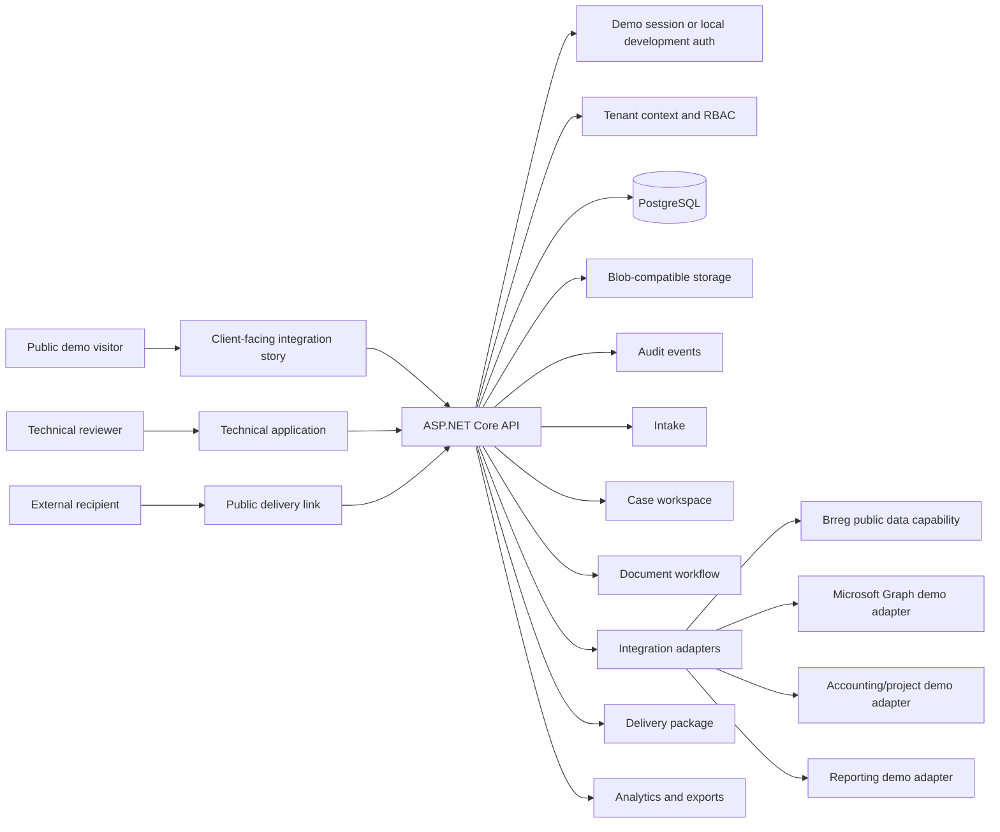
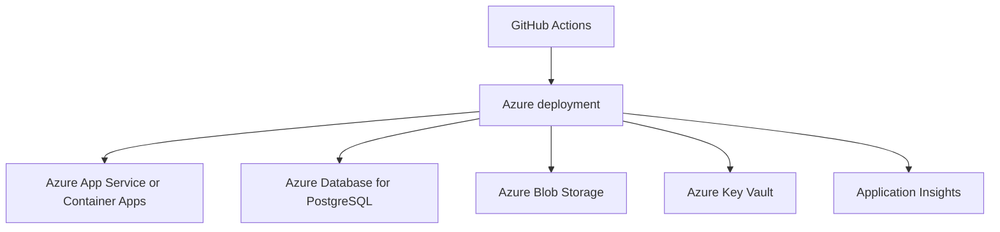

# Architecture

## Architecture Goals

- Professional but not artificially enterprise-heavy.
- Clear separation between domain logic, application use cases, infrastructure, HTTP API, and worker jobs.
- Multi-tenant and audit-friendly from the first phase.
- External integrations behind adapter interfaces.
- AI implemented as assistive suggestions with human review.
- Local development should be easy to run with Docker Compose.
- Code files should stay small and modular. Large files must be split according to `docs/coding-standards.md`.

The public presentation is a single client-facing integration case study. The
broader architecture remains available as technical evidence and is not exposed
as a generic SaaS dashboard in the primary visitor flow.

## System Diagram



## Request Flow

1. A request enters through the fictional email/form scenario, manual entry, or API.
2. The API resolves tenant context from the authenticated user or demo session.
3. Every business query is scoped to the current tenant.
4. AI and external-system behavior is isolated behind adapter interfaces.
5. Human approvals convert suggestions into final data.
6. Documents and delivery artifacts are stored through the configured provider.
7. Delivery links use random tokens, expose only selected items, and record access.
8. Audit and analytics provide tenant-scoped operational evidence.

## Repository Structure

```txt
norvix-workflow-hub/
  README.md
  docs/
  frontend/
    package.json
    src/
      app/
      components/
      features/
      lib/
      types/
      tests/
  backend/
    NorvixHub.sln
    src/
      NorvixHub.Api/
      NorvixHub.Application/
      NorvixHub.Domain/
      NorvixHub.Infrastructure/
      NorvixHub.Worker/
      NorvixHub.Contracts/
    tests/
      NorvixHub.UnitTests/
      NorvixHub.IntegrationTests/
      NorvixHub.ContractTests/
  infra/
    terraform/
      modules/
      environments/
        dev/
        demo/
  connectors/
    power-platform/
      openapi.yaml
      README.md
    postman/
  sample-data/
    demo-tenant.json
    demo-documents/
    mock-intakes/
  scripts/
    seed-demo-data.ps1
    seed-demo-data.sh
  docker-compose.yml
  .github/
    workflows/
      ci.yml
      deploy-demo.yml
```

## Frontend

Recommended stack:

- Next.js App Router;
- TypeScript;
- Tailwind CSS;
- shadcn/ui or Radix UI primitives;
- React Hook Form and Zod;
- MSAL.js for Microsoft Entra ID;
- Playwright for E2E tests.

Initial page areas:

- Dashboard;
- Intake Inbox;
- Review Queue;
- Case Workspace;
- Documents;
- Integrations;
- Delivery Portal;
- Admin/Security/Privacy.

## Backend

Recommended stack:

- ASP.NET Core / .NET 10;
- C#;
- Entity Framework Core;
- Npgsql;
- PostgreSQL;
- OpenAPI/Swagger or Scalar;
- Serilog;
- OpenTelemetry;
- xUnit, FluentAssertions, Testcontainers.

Project responsibilities:

- `NorvixHub.Domain`: entities, value objects, enums, domain events.
- `NorvixHub.Application`: use cases, commands, queries, validators, interfaces.
- `NorvixHub.Infrastructure`: EF Core, storage, external API clients, AI providers, auth implementations.
- `NorvixHub.Api`: HTTP endpoints, auth, middleware, OpenAPI, request/response mapping.
- `NorvixHub.Worker`: background processing for AI, documents, integration syncs, notifications.
- `NorvixHub.Contracts`: DTOs and shared API contracts where useful.

## Backend Pattern

Use a practical clean architecture with vertical slices where useful:

- Keep feature logic close together in the Application layer.
- Avoid a generic repository unless it reduces real complexity.
- Use EF Core directly in infrastructure/application handlers through clear abstractions where needed.
- Model tenant context as a first-class dependency.
- Keep controllers/endpoints thin.
- Keep handlers, endpoints, services, and components below the documented file size limits.

## Tenant Context

Tenant context must come from authenticated user membership, not from client input alone.

Every tenant-scoped query must include:

```txt
WHERE tenant_id = current_tenant_id
```

For EF Core, prefer global query filters plus explicit tests, but do not rely on filters alone for security-sensitive operations.

## External Integrations

Create adapter interfaces for:

- Brreg company lookup;
- Microsoft Graph / SharePoint;
- accounting/project system;
- Power BI/Fabric export;
- AI provider;
- document storage;
- email/form intake.

Each adapter should support:

- mock implementation;
- real implementation later;
- sync status reporting;
- failure logging;
- retry where appropriate.

## Async Processing

Worker jobs handle:

- AI analysis;
- document classification;
- PDF generation;
- integration syncs;
- email/form mock imports;
- export jobs.

MVP can use simple background jobs. Later versions can use Azure Service Bus or Azure Storage Queue.

## Storage

- PostgreSQL stores structured data and metadata.
- Azure Blob Storage stores file binaries.
- Azurite is used locally.
- Files are never served from web root.
- Public delivery downloads go through authorization/token checks.

## Observability

Minimum:

- structured logs with correlation IDs;
- audit events for business/security actions;
- health endpoint;
- integration sync logs;
- OpenTelemetry instrumentation;
- Application Insights in cloud.

## Deployment Direction

Initial cloud target:

- Azure App Service or Azure Container Apps;
- Azure Database for PostgreSQL Flexible Server;
- Azure Blob Storage;
- Azure Key Vault;
- Application Insights.

Infrastructure is described with Terraform.


